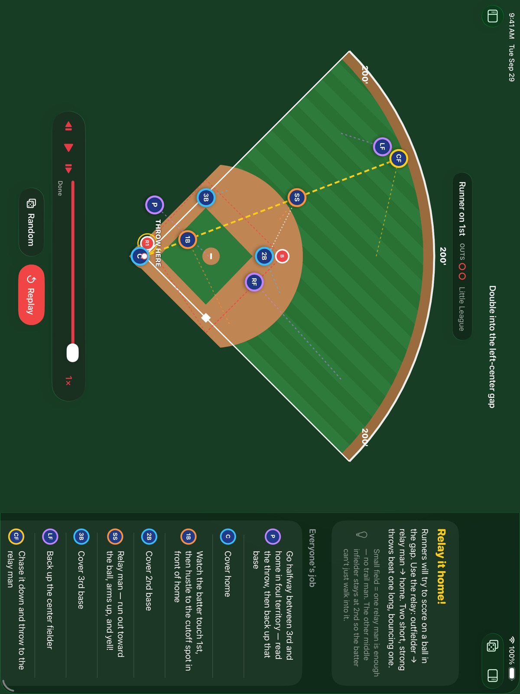
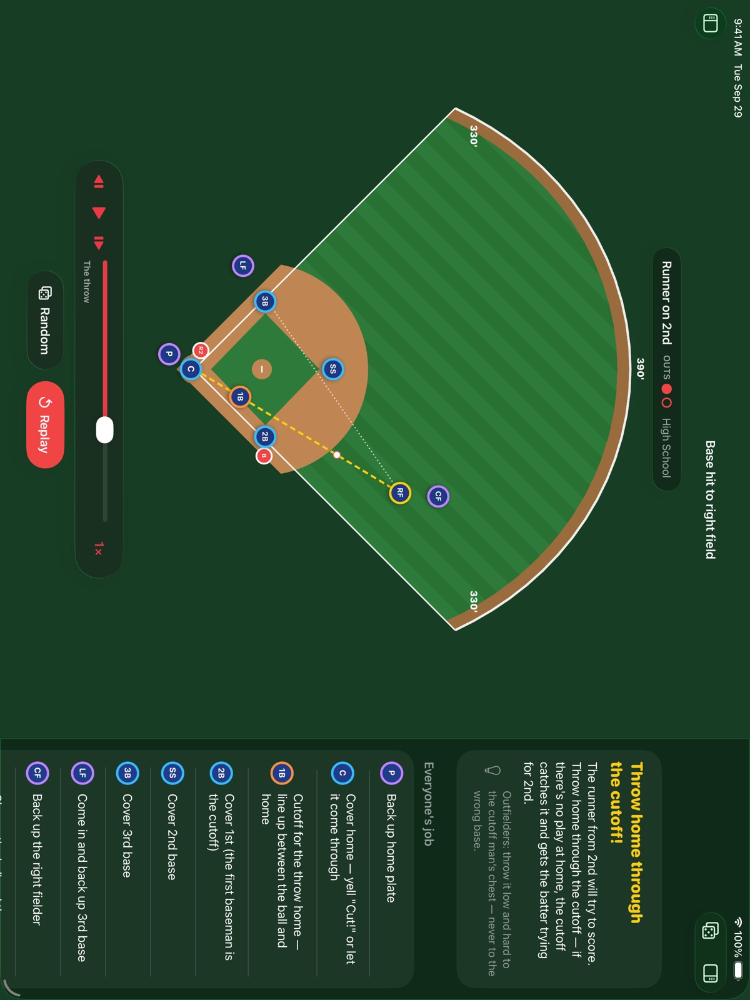
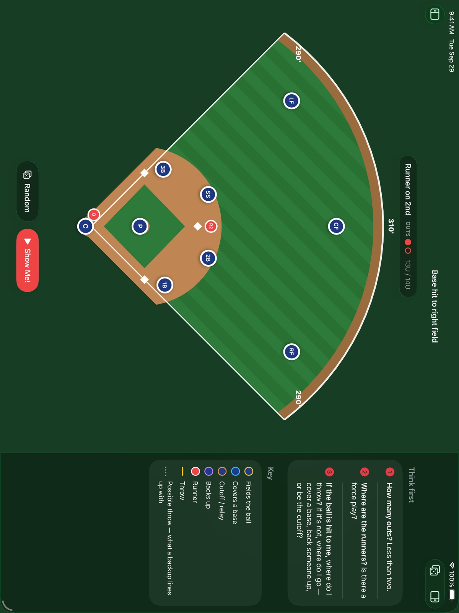
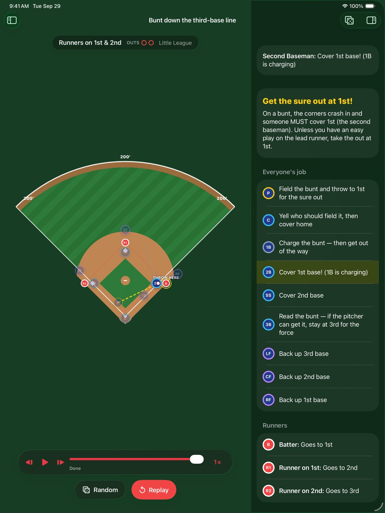
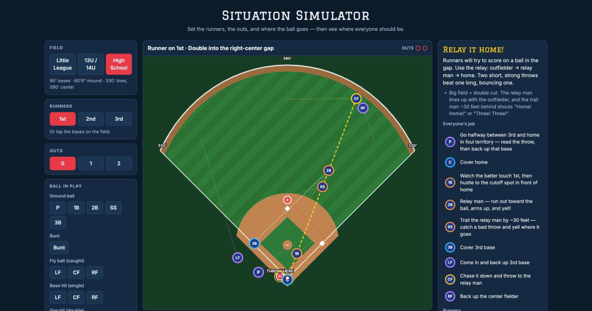

# Baseball Situation Simulator

A teaching tool for young players. Set up a situation — runners, outs, and where the ball is hit — and watch where all nine fielders should go, what the runners do, and where the ball gets thrown. Built to help kids learn cutoffs, relays, backups, and base coverage.

It comes in two versions that share the same rules:

- **Web** — a single page you can open in any browser.
- **iPad app** — a native SwiftUI app with playback controls and quiz mode.



## What it does

- **Three field sizes** — Little League (60' bases, 200' fence), 13U/14U (80' bases, ~300'), and High School (90' bases, 330'/390'). Plays change with the field: a Little League gap double uses one relay man, while bigger fields use the double cut with a trail man.
- **16 plays** — ground balls to each infielder, bunts, caught fly balls, singles, gap doubles, and doubles down the 1st- and 3rd-base lines, with any combination of runners and 0–2 outs.
- **Everyone's job** — each fielder is color-coded by what they're doing: fielding the ball, covering a base, cutoff/relay, or backing up.
- **The throw and the "possible throw"** — the real throw is drawn in yellow; a dotted line shows the throw a backup is lining up behind, so every backup is standing on a visible line.
- **Why, not just where** — each play explains the reasoning, plus coaching tips.
- **Quiz mode** — pick your kid's position, have them place where they think they should go, then reveal and grade it.
- **Where this comes from** — every rule is tagged with how it holds up against published coaching sources ("Matches sources" or "Varies by coach"), with links.

## Screenshots

**Playback controls** — pause, step, scrub to any moment, and slow it down to ¼× speed.



| Setting up a situation | Quiz mode |
|---|---|
|  |  |

**Web version** — a High School double cut, relaying the ball home.



## Running it

### Web

No build step. Open `index.html` in a browser, or serve the folder:

```sh
python3 -m http.server 8765
# then open http://localhost:8765
```

### Mac app (installs once, then updates itself)

1. Download **Situations.zip** from the [latest release](https://github.com/martyvasquez/baseball-simulator/releases/latest).
2. Double-click it and drag **Situations** into **Applications**.
3. Open it. The first time, macOS can't verify the developer: click **Done**, then **System Settings → Privacy & Security → Open Anyway**.

After that, the app keeps itself up to date. Every push to `main` that changes the app builds, tests, and publishes a new release ([release-mac.yml](.github/workflows/release-mac.yml)). The next time the app is opened, it downloads the update, installs it, and relaunches. **Situations → Check for Updates…** does the same on demand. Needs macOS 14 or later, Intel or Apple Silicon.

Updates are verified with a [Sparkle](https://sparkle-project.org) signature: the private key is stored only in the `SPARKLE_PRIVATE_KEY` repository secret (and the maintainer's keychain), and the app rejects any update not signed with it.

### iPad app

Requires Xcode 26 or later; the app runs on iPadOS 26+.

1. Open `ios/SituationSim.xcodeproj`.
2. Under **Signing & Capabilities**, choose your own team and change the bundle ID from `com.martyvasquez.SituationSim`.
3. Pick your iPad (or an iPad simulator) and press **Run**.

The Xcode project is generated from `ios/project.yml` with [XcodeGen](https://github.com/yonaskolb/XcodeGen). After adding or removing files, run `xcodegen generate` in `ios/`.

Keyboard shortcuts: **Space** show the play / play–pause · **← →** step · **⌘R** random situation.

## How it's organized

| Path | What's there |
|---|---|
| `engine.js` | The rules: given a situation, where everyone goes and why. |
| `sources.js` | Notes on each rule, checked against published coaching sources. |
| `index.html`, `app.js`, `styles.css` | The web page. |
| `ios/SituationSim/Engine/` | Swift port of the rules engine. |
| `ios/SituationSim/Views/` | The iPad interface (field drawing, sidebar, answer panel, playback bar). |
| `ios/SituationSimTests/` | Tests, including the engine parity check. |
| `scripts/export-ios-data.js` | Exports the web engine's answers and rule notes for the iPad app. |

### Changing a rule

The rules live in two places: `engine.js` (web) and `ios/SituationSim/Engine/Solver.swift` (iPad). They're kept identical by a test that compares the Swift engine against the web engine's answers for all 1,152 situations (16 plays × 8 runner setups × 3 out counts × 3 field sizes).

To change a rule:

1. Edit it in `engine.js` and in `Solver.swift`.
2. Re-export the web engine's answers (and the rule notes from `sources.js`) for the iPad app:
   ```sh
   node scripts/export-ios-data.js
   ```
3. Run the tests (**⌘U** in Xcode). If the two engines disagree, the test names the exact situation and player.

## About the rules

Coverage assignments come from coaching material, not a rulebook — former college and pro coaches, position guides, and team coverage charts. Field dimensions come from Little League and NFHS specs. Where coaches teach a play more than one way, the app notes it. Exact spots (how many feet behind a base a backup stands) are estimates. If your team teaches something differently, change it — the rules are written in plain language.
